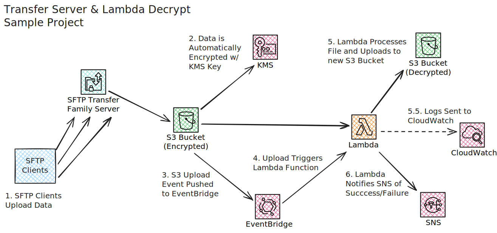

# AWS SFTP Transfer Server with Automated File Processing

## Overview

This project deploys an AWS CloudFormation Stack that sets up an SFTP endpoint using AWS Transfer Family where users can
securely upload "encrypted" files to a S3 bucket. An EventBridge rule triggers a Lambda function whenever a new file is
uploaded. The Lambda function "decrypts" each uploaded file and moves it to a separate decrypted S3 bucket.
Notifications are sent via SNS on successful or failed processing. The decryption process is a placeholder operation and
can be easily substituted with a more meaningful function.

This project is meant as an example, and is not a template for a production environment.

## System Architecture



### Data follows the path illustrated on the above image.

1. SFTP Clients uploads data to a provided SFTP URI
2. SFTP Transfer Server places files in a dedicated "encrypted" S3 Bucket
3. S3 emits notifications to EventBridge
4. EventBridge receives these notifications and triggers a lambda function, passing along the recently uploaded object
   and bucket information
5. Lambda function downloads the specified file and "decrypts" it
6. Lambda notifies SNS of success/failure
7. SNS notifications are sent out to administrators

## Setup & Installation

### Prerequisites

- AWS Account: You need an AWS account to deploy the resources.
- AWS CLI: Installed and configured with appropriate permissions.
- AWS SAM CLI: For building and deploying the application.
- Python 3.11: Required for the Lambda function runtime.
- SSH Client: To generate SSH keys and connect to the SFTP server.

### 1. Install Pre-Commit Hooks (Optional)

This project uses pre-commit for code formatting and linting.

```bash
pip install pre-commit
pre-commit install
```

### 2. Build the Application

Use the AWS SAM CLI to build the application. This ensures proper packaging of Lambda functions.

```bash
sam build
```

### 3. Deploy the Application

Deploy the application using the SAM CLI. The --guided flag will prompt you for required parameters. This will create
a new CLoudFormation stack you can monitor and manage in the AWS console.

```bash
sam deploy --guided
```

## Deployment Parameters

During deployment, you will be prompted to provide the following parameters:

- `AlertEmail`: The email address to receive SNS notifications.
- `UserName`: The username for the SFTP user.
- `SshPublicKey`: The SSH public key for the SFTP user.

These may also be preconfigured in your `samconfig.toml` file:

```toml
# ./samconfig.toml
version = 0.1
[default.deploy.parameters]
stack_name = "lambda-example-app"
resolve_s3 = true
s3_prefix = "lambda-example-app"
region = "us-east-1"
confirm_changeset = true
capabilities = ["CAPABILITY_NAMED_IAM"]
parameter_overrides = "AlertEmail=\"email@example.com\" UserName=\"sftpuser\" SshPublicKey=\"ssh-rsa AAAA...\""
image_repositories = []
```

## Example Deployment

You will need to provide a public ssh key during deployment.

```bash
sam deploy --parameter-overrides \
    AlertEmail=email@example.com \
    UserName=sftpuser \
    SshPublicKey="$(cat my_ssh_key.pub)"
```

## Usage & Uploads

### 1. Connect to the SFTP Server

Use an SFTP client like FileZilla or the command line to connect:

```bash
sftp -i my_ssh_key -o "IdentitiesOnly=yes" sftpuser@<SERVER-ENDPOINT>
```

### 2. Upload Files

Once connected, you can upload files:

```sftp
put local_file.txt
```

### 3. Monitor Processing

- View your S3 buckets to track file movement
- Check Lambda logs to monitor processes and successes
- View logs in CloudWatch

## CI/CD Integration

The project includes a sample GitLab CI/CD pipeline configuration (.gitlab-ci.yml) that:

- Runs tests
- Builds the application
- Deploys the application when changes are pushed to the main branch

### GitLab CI Environment Variables

You need to set the following variables in your GitLab project settings:

- `AWS_DEFAULT_REGION`
- `AWS_ACCESS_KEY_ID`
- `AWS_SECRET_ACCESS_KEY`
- `AlertEmail`
- `UserName`
- `SshPublicKey`

## Additional Considerations & Improvements

To further develop this sample project consider:

- Implementing a pre-shared key system to pre-encrypt client uploads
- Improving IAM roles to limit lambda KMS permissions
    - Define a KMS key for use in encrypting the buckets
- Adding support for multiple Users
    - Define users from a separate file
    - Integrate with external authentication
- Improving error handling of Lambda function to retry on certain failures
- Adding full integration tests that test the upload, download and notifications
- Improving SNS notifications with meaningful email templates or additional notification channels
- More robust CI/CD integration
